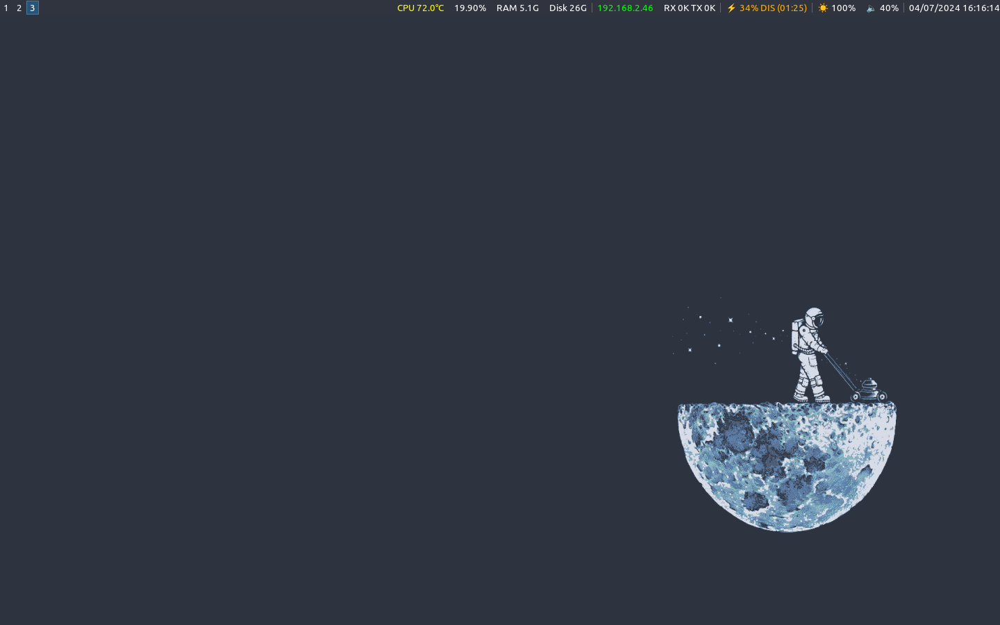

Dependencies:
-
- i3
- i3blocks
- i3status
- kitty
- rofi
- rofi-power-menu
- i3lock-color
- xss-lock
- brightnessctl
- feh
- Pulseaudio (should be already installed if using Mint)

Other programs mentioned:
-
- Flameshot
- zsh
- ohmyzsh
- Firefox Developer Edition
- neofetch

Disclaimers:
-
- Make sure that your user has permission to run `brightnessctl` without root/sudo.
- Edit `/etc/systemd/logind.conf`, uncomment and set `HandleLidSwitch` to `ignore`. This results in the laptop not going into suspend when closing the lid - you will have to do that manually with `$mod+shift+x`, but this allows the i3lock to run properly.
- Edit `/etc/systemd/logind.conf`, also uncomment and set `HandlePowerKey` to `ignore` to avoid turning off your laptop if you accidentally press the power key instead of backspace.
- The `scripts` directory in this repository should be placed in `/usr/share/i3blocks`. Make sure you change the `iface` and `network` configuration for i3blocks should your interface name be different.
- This configuration expects `i3lock-color` and `rofi-power-menu` to be present in the PATH (refer to their respective installation instructions and check with `whereis`).
- Firefox Developer Edition is specified in the i3 config (and should also be present in the PATH) - if you do not want it installed, just replace `firefox-dev` with `firefox`.
- Keybinds `$Mod+Space` and `$Mod+M` change the keyboard layout between **us** and **gr** respectively. Make sure to change the layouts according to your preferences.

To-Do:
-
- Make keyboard layouts switchable with a single keybind instead of having separate ones for each layout.